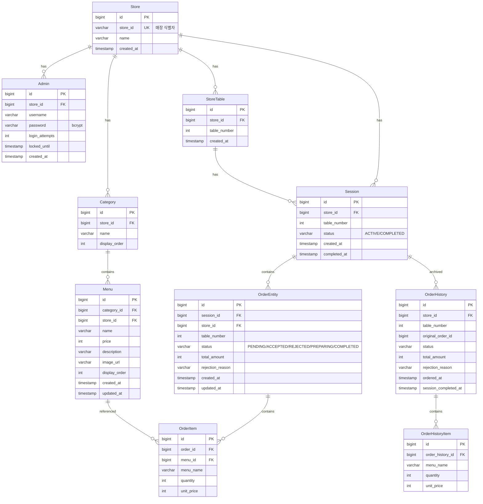

# Database Schema & ERD

## ERD

## 테이블 설명

| 테이블 | 설명 |
|--------|------|
| Store | 매장 정보 |
| Admin | 관리자 계정 (매장당 N명) |
| StoreTable | 테이블 정보 (매장당 N개) |
| Category | 메뉴 카테고리 |
| Menu | 메뉴 항목 |
| Session | 테이블 세션 (ACTIVE/COMPLETED) |
| OrderEntity | 주문 (현재 활성 세션) |
| OrderItem | 주문 항목 (메뉴별 수량/단가) |
| OrderHistory | 과거 주문 (세션 종료 시 이동) |
| OrderHistoryItem | 과거 주문 항목 |

## 주요 설계 결정

- OrderItem에 menu_name, unit_price를 스냅샷으로 저장 (메뉴 변경 시 기존 주문 영향 방지)
- Session은 store_id + table_number + status=ACTIVE 조합으로 활성 세션 조회
- OrderHistory는 Order와 별도 테이블로 분리 (세션 종료 시 데이터 이동)
