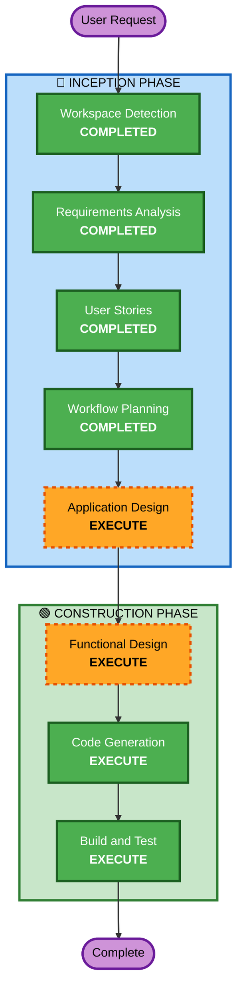

# Execution Plan

## Detailed Analysis Summary

### Change Impact Assessment
- **User-facing changes**: Yes - 고객 QR코드 접근/주문, 관리자 대시보드/주문 승인/거절
- **Structural changes**: Yes - Greenfield 전체 설계
- **Data model changes**: Yes - Store, Menu, Order, Table, Session, OrderHistory 전체 신규
- **API changes**: Yes - REST API 전체 신규
- **NFR impact**: Yes - JWT 인증, 트랜잭션 처리

### Risk Assessment
- **Risk Level**: Medium
- **Rollback Complexity**: Easy (신규 프로젝트)
- **Testing Complexity**: Moderate

## Workflow Visualization



### Text Alternative
```
Phase 1: INCEPTION
- Workspace Detection (COMPLETED)
- Requirements Analysis (COMPLETED)
- User Stories (COMPLETED)
- Workflow Planning (COMPLETED)
- Application Design (EXECUTE)

Phase 2: CONSTRUCTION
- Functional Design (EXECUTE)
- NFR Requirements (SKIP)
- NFR Design (SKIP)
- Infrastructure Design (SKIP)
- Code Generation (EXECUTE)
- Build and Test (EXECUTE)
```

## Phases to Execute

### 🔵 INCEPTION PHASE
- [x] Workspace Detection (COMPLETED)
- [x] Requirements Analysis (COMPLETED)
- [x] User Stories (COMPLETED)
- [x] Workflow Planning (COMPLETED)
- [ ] Application Design - EXECUTE
  - **Rationale**: 신규 프로젝트로 컴포넌트 구조, 서비스 레이어, 데이터 모델 설계 필요
- ~~Units Generation~~ - SKIP
  - **Rationale**: 단일 Spring Boot 애플리케이션으로 unit 분리 불필요

### 🟢 CONSTRUCTION PHASE
- [ ] Functional Design - EXECUTE
  - **Rationale**: 주문 상태 머신, 세션 관리 등 복잡한 비즈니스 로직 상세 설계 필요
- ~~NFR Requirements~~ - SKIP
  - **Rationale**: 요구사항에서 이미 명확히 정의됨 (JWT 16시간, SSE 2초, bcrypt)
- ~~NFR Design~~ - SKIP
  - **Rationale**: NFR Requirements 스킵에 따라 스킵
- ~~Infrastructure Design~~ - SKIP
  - **Rationale**: 로컬 개발 환경만 대상
- [ ] Code Generation - EXECUTE (ALWAYS)
  - **Rationale**: Spring Boot 애플리케이션 코드 구현
- [ ] Build and Test - EXECUTE (ALWAYS)
  - **Rationale**: 빌드 및 테스트 지침 생성

## Success Criteria
- **Primary Goal**: 테이블오더 Backend API 완성 (Swagger 문서 포함)
- **Key Deliverables**: Spring Boot 애플리케이션, REST API, MySQL 스키마
- **Quality Gates**: 빌드 성공, API 문서 자동 생성, 주요 비즈니스 로직 동작 확인
